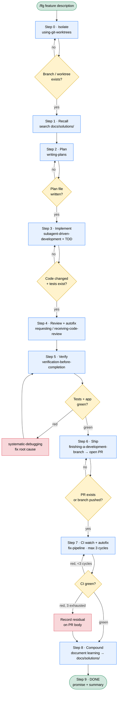

# lfg — Autonomous Engineering Autopilot (self-contained skill)

A single, **self-contained** agent skill that runs an entire software task end-to-end, hands-off:
recall prior learnings → plan → implement with TDD → review & autofix → verify → commit, push,
open PR → watch CI and fix failures → compound the learning.

`/lfg [feature description]` runs the whole pipeline **without stopping to ask anything**. It is an
explicit opt-in autopilot — use it only when you want hands-off execution of a described task.

## Pipeline



## Why this exists

The pipeline is normally an orchestrator that invokes a dozen separately-installed skills. This
repo **bundles every technique it needs into one folder**, so there is **zero dependency on any
plugin or skill library**. Copy the folder anywhere and it runs.

## Layout

```
lfg/
├── SKILL.md            # the orchestrator pipeline (Steps 0–9)
└── references/         # 13 bundled technique skills, each in its own folder
    ├── using-git-worktrees/
    ├── writing-plans/
    ├── subagent-driven-development/
    ├── test-driven-development/
    ├── executing-plans/
    ├── requesting-code-review/
    ├── receiving-code-review/
    ├── verification-before-completion/
    ├── systematic-debugging/
    ├── finishing-a-development-branch/
    ├── fix-pipeline/
    ├── compound/
    └── dispatching-parallel-agents/
```

Each step in `SKILL.md` reads the relevant `references/<name>/SKILL.md` and follows it — no `Skill`
tool, no `superpowers:` namespace required.

## Install

Drop the `lfg/` folder into your agent's skills directory, e.g.:

```bash
# Claude Code
git clone https://github.com/alexanderop/lfg-skill ~/.claude/skills/lfg

# or any harness that loads skills from a folder
cp -R lfg /path/to/your/skills/
```

Then invoke `/lfg <feature description>`.

## Caveat

This is a **snapshot** of the bundled techniques at the time it was assembled. It does not
auto-sync with upstream improvements.

## Attribution & License

Most bundled techniques under `references/` are derived from
[Superpowers](https://github.com/obra/superpowers) by Jesse Vincent, used under the MIT License.
The original copyright notice is preserved in [LICENSE](./LICENSE). This bundle is also released
under the MIT License.
